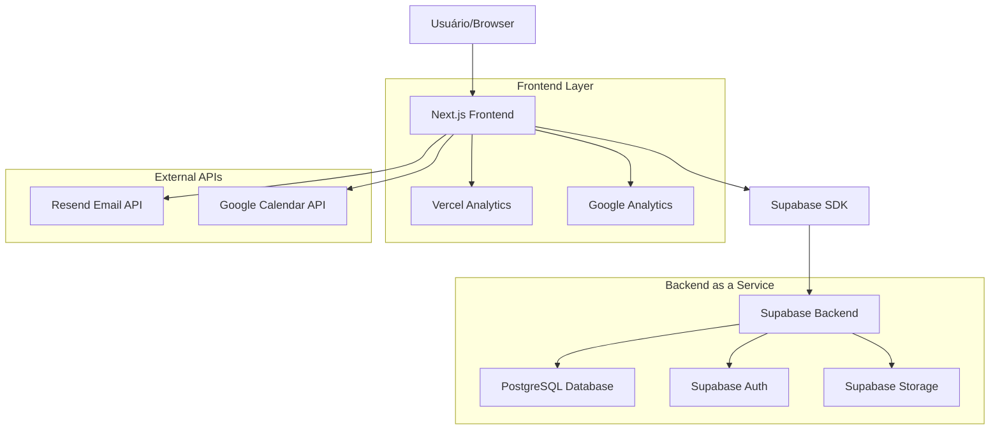
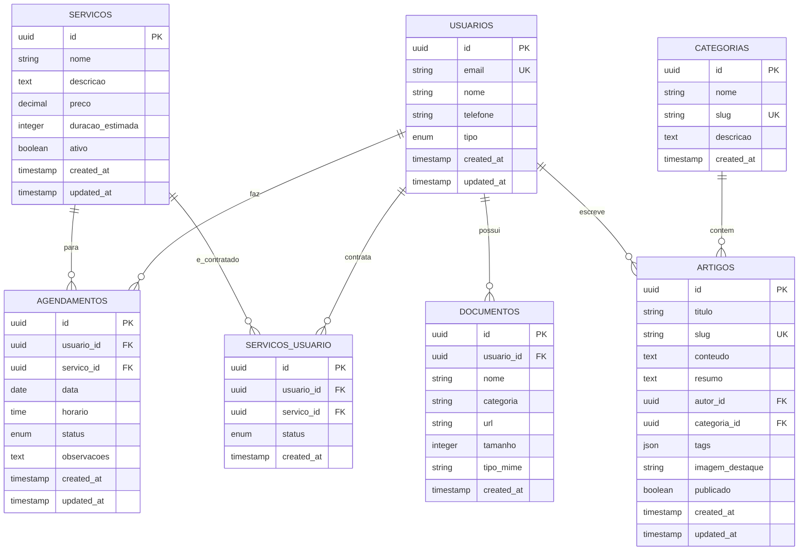

# Arquitetura Técnica - Melhorias Site Brandão Contabilidade

## 1. Arquitetura Geral



## 2. Descrição das Tecnologias

### Frontend
- **Next.js 14+** com App Router para SSR/SSG otimizado
- **React 18+** para componentes interativos
- **Tailwind CSS 3+** para styling responsivo e consistente
- **Framer Motion** para animações e micro-interações
- **React Hook Form + Zod** para formulários e validação
- **Headless UI/Radix UI** para componentes acessíveis

### Backend/Serviços
- **Supabase** como Backend-as-a-Service principal
- **PostgreSQL** (via Supabase) para banco de dados
- **Supabase Auth** para autenticação e autorização
- **Supabase Storage** para upload de arquivos
- **Resend** para envio de emails transacionais

### Ferramentas e Monitoramento
- **Vercel** para deploy e hosting
- **Vercel Analytics** para métricas de performance
- **Google Analytics 4** para análise de comportamento
- **Lighthouse CI** para monitoramento contínuo de performance

## 3. Definições de Rotas

| Rota | Propósito | Tipo |
|------|-----------|------|
| `/` | Página inicial com hero e CTAs principais | Pública |
| `/servicos` | Lista de serviços oferecidos | Pública |
| `/contato` | Formulário de contato e informações | Pública |
| `/agendamento` | Sistema de agendamento online | Pública |
| `/blog` | Lista de artigos e conteúdo educativo | Pública |
| `/blog/[slug]` | Página individual de artigo | Pública |
| `/calculadoras` | Ferramentas de cálculo fiscal | Pública |
| `/calculadoras/[tipo]` | Calculadora específica (impostos, pró-labore) | Pública |
| `/cliente/login` | Página de login do cliente | Pública |
| `/cliente/registro` | Página de registro de novo cliente | Pública |
| `/cliente/dashboard` | Dashboard principal do cliente | Privada |
| `/cliente/documentos` | Gestão de documentos do cliente | Privada |
| `/cliente/servicos` | Histórico de serviços do cliente | Privada |
| `/cliente/perfil` | Configurações do perfil do cliente | Privada |
| `/admin/dashboard` | Dashboard administrativo | Admin |
| `/admin/clientes` | Gestão de clientes | Admin |
| `/admin/agendamentos` | Gestão de agendamentos | Admin |
| `/admin/blog` | Gestão de conteúdo do blog | Admin |

## 4. Definições de API

### 4.1 APIs Core

#### Autenticação
```typescript
// Supabase Auth (gerenciado automaticamente)
POST /auth/v1/signup
POST /auth/v1/token
POST /auth/v1/logout
POST /auth/v1/recover
```

#### Agendamentos
```typescript
POST /api/agendamentos
```

Request:
| Parâmetro | Tipo | Obrigatório | Descrição |
|-----------|------|-------------|------------|
| nome | string | true | Nome completo do cliente |
| email | string | true | Email para contato |
| telefone | string | true | Telefone para contato |
| servico | string | true | Tipo de serviço solicitado |
| data | string | true | Data desejada (ISO 8601) |
| horario | string | true | Horário desejado |
| observacoes | string | false | Observações adicionais |

Response:
| Parâmetro | Tipo | Descrição |
|-----------|------|------------|
| success | boolean | Status da operação |
| agendamento_id | string | ID do agendamento criado |
| message | string | Mensagem de confirmação |

#### Contato
```typescript
POST /api/contato
```

Request:
| Parâmetro | Tipo | Obrigatório | Descrição |
|-----------|------|-------------|------------|
| nome | string | true | Nome do remetente |
| email | string | true | Email do remetente |
| telefone | string | false | Telefone para contato |
| assunto | string | true | Assunto da mensagem |
| mensagem | string | true | Conteúdo da mensagem |

#### Upload de Documentos
```typescript
POST /api/documentos/upload
```

Request (multipart/form-data):
| Parâmetro | Tipo | Obrigatório | Descrição |
|-----------|------|-------------|------------|
| arquivo | File | true | Arquivo a ser enviado |
| categoria | string | true | Categoria do documento |
| descricao | string | false | Descrição do documento |

### 4.2 Tipos TypeScript Compartilhados

```typescript
// Tipos de usuário
interface Usuario {
  id: string;
  email: string;
  nome: string;
  telefone?: string;
  tipo: 'cliente' | 'admin';
  created_at: string;
  updated_at: string;
}

// Tipos de agendamento
interface Agendamento {
  id: string;
  usuario_id: string;
  servico: string;
  data: string;
  horario: string;
  status: 'pendente' | 'confirmado' | 'cancelado' | 'concluido';
  observacoes?: string;
  created_at: string;
  updated_at: string;
}

// Tipos de documento
interface Documento {
  id: string;
  usuario_id: string;
  nome: string;
  categoria: string;
  url: string;
  tamanho: number;
  tipo_mime: string;
  created_at: string;
}

// Tipos de serviço
interface Servico {
  id: string;
  nome: string;
  descricao: string;
  preco?: number;
  duracao_estimada?: number;
  ativo: boolean;
}

// Tipos de artigo do blog
interface Artigo {
  id: string;
  titulo: string;
  slug: string;
  conteudo: string;
  resumo: string;
  autor: string;
  categoria: string;
  tags: string[];
  imagem_destaque?: string;
  publicado: boolean;
  created_at: string;
  updated_at: string;
}
```

## 5. Modelo de Dados

### 5.1 Diagrama ER



### 5.2 DDL (Data Definition Language)

#### Tabela de Usuários
```sql
-- Extensão para UUIDs
CREATE EXTENSION IF NOT EXISTS "uuid-ossp";

-- Tabela de usuários (estende auth.users do Supabase)
CREATE TABLE public.usuarios (
    id UUID PRIMARY KEY DEFAULT uuid_generate_v4(),
    auth_id UUID REFERENCES auth.users(id) ON DELETE CASCADE,
    nome VARCHAR(255) NOT NULL,
    telefone VARCHAR(20),
    tipo VARCHAR(20) DEFAULT 'cliente' CHECK (tipo IN ('cliente', 'admin')),
    created_at TIMESTAMP WITH TIME ZONE DEFAULT NOW(),
    updated_at TIMESTAMP WITH TIME ZONE DEFAULT NOW()
);

-- Índices
CREATE INDEX idx_usuarios_auth_id ON public.usuarios(auth_id);
CREATE INDEX idx_usuarios_tipo ON public.usuarios(tipo);
```

#### Tabela de Serviços
```sql
CREATE TABLE public.servicos (
    id UUID PRIMARY KEY DEFAULT uuid_generate_v4(),
    nome VARCHAR(255) NOT NULL,
    descricao TEXT,
    preco DECIMAL(10,2),
    duracao_estimada INTEGER, -- em minutos
    ativo BOOLEAN DEFAULT true,
    created_at TIMESTAMP WITH TIME ZONE DEFAULT NOW(),
    updated_at TIMESTAMP WITH TIME ZONE DEFAULT NOW()
);

-- Dados iniciais
INSERT INTO public.servicos (nome, descricao, preco, duracao_estimada) VALUES
('Abertura de Empresa', 'Processo completo de abertura de empresa', 800.00, 120),
('Contabilidade Mensal', 'Serviços contábeis mensais completos', 300.00, 60),
('Declaração de Imposto de Renda', 'Elaboração e envio da declaração', 150.00, 90),
('Consultoria Fiscal', 'Consultoria especializada em questões fiscais', 200.00, 60),
('Alteração Contratual', 'Modificações no contrato social', 400.00, 90);
```

#### Tabela de Agendamentos
```sql
CREATE TABLE public.agendamentos (
    id UUID PRIMARY KEY DEFAULT uuid_generate_v4(),
    usuario_id UUID REFERENCES public.usuarios(id) ON DELETE CASCADE,
    servico_id UUID REFERENCES public.servicos(id),
    data DATE NOT NULL,
    horario TIME NOT NULL,
    status VARCHAR(20) DEFAULT 'pendente' CHECK (status IN ('pendente', 'confirmado', 'cancelado', 'concluido')),
    observacoes TEXT,
    created_at TIMESTAMP WITH TIME ZONE DEFAULT NOW(),
    updated_at TIMESTAMP WITH TIME ZONE DEFAULT NOW()
);

-- Índices
CREATE INDEX idx_agendamentos_usuario_id ON public.agendamentos(usuario_id);
CREATE INDEX idx_agendamentos_data ON public.agendamentos(data);
CREATE INDEX idx_agendamentos_status ON public.agendamentos(status);
```

#### Tabela de Documentos
```sql
CREATE TABLE public.documentos (
    id UUID PRIMARY KEY DEFAULT uuid_generate_v4(),
    usuario_id UUID REFERENCES public.usuarios(id) ON DELETE CASCADE,
    nome VARCHAR(255) NOT NULL,
    categoria VARCHAR(100) NOT NULL,
    url TEXT NOT NULL,
    tamanho INTEGER NOT NULL,
    tipo_mime VARCHAR(100) NOT NULL,
    created_at TIMESTAMP WITH TIME ZONE DEFAULT NOW()
);

-- Índices
CREATE INDEX idx_documentos_usuario_id ON public.documentos(usuario_id);
CREATE INDEX idx_documentos_categoria ON public.documentos(categoria);
```

#### Tabela de Categorias (Blog)
```sql
CREATE TABLE public.categorias (
    id UUID PRIMARY KEY DEFAULT uuid_generate_v4(),
    nome VARCHAR(255) NOT NULL,
    slug VARCHAR(255) UNIQUE NOT NULL,
    descricao TEXT,
    created_at TIMESTAMP WITH TIME ZONE DEFAULT NOW()
);

-- Dados iniciais
INSERT INTO public.categorias (nome, slug, descricao) VALUES
('Tributação', 'tributacao', 'Artigos sobre impostos e tributação'),
('Contabilidade', 'contabilidade', 'Conteúdo sobre práticas contábeis'),
('Legislação', 'legislacao', 'Atualizações e mudanças na legislação'),
('Dicas Empresariais', 'dicas-empresariais', 'Orientações para empresários');
```

#### Tabela de Artigos (Blog)
```sql
CREATE TABLE public.artigos (
    id UUID PRIMARY KEY DEFAULT uuid_generate_v4(),
    titulo VARCHAR(255) NOT NULL,
    slug VARCHAR(255) UNIQUE NOT NULL,
    conteudo TEXT NOT NULL,
    resumo TEXT,
    autor_id UUID REFERENCES public.usuarios(id),
    categoria_id UUID REFERENCES public.categorias(id),
    tags JSONB DEFAULT '[]',
    imagem_destaque TEXT,
    publicado BOOLEAN DEFAULT false,
    created_at TIMESTAMP WITH TIME ZONE DEFAULT NOW(),
    updated_at TIMESTAMP WITH TIME ZONE DEFAULT NOW()
);

-- Índices
CREATE INDEX idx_artigos_slug ON public.artigos(slug);
CREATE INDEX idx_artigos_categoria_id ON public.artigos(categoria_id);
CREATE INDEX idx_artigos_publicado ON public.artigos(publicado);
CREATE INDEX idx_artigos_tags ON public.artigos USING GIN(tags);
```

#### Políticas de Segurança (RLS)
```sql
-- Habilitar RLS em todas as tabelas
ALTER TABLE public.usuarios ENABLE ROW LEVEL SECURITY;
ALTER TABLE public.agendamentos ENABLE ROW LEVEL SECURITY;
ALTER TABLE public.documentos ENABLE ROW LEVEL SECURITY;
ALTER TABLE public.artigos ENABLE ROW LEVEL SECURITY;

-- Políticas para usuários
CREATE POLICY "Usuários podem ver próprio perfil" ON public.usuarios
    FOR SELECT USING (auth.uid() = auth_id);

CREATE POLICY "Usuários podem atualizar próprio perfil" ON public.usuarios
    FOR UPDATE USING (auth.uid() = auth_id);

-- Políticas para agendamentos
CREATE POLICY "Usuários podem ver próprios agendamentos" ON public.agendamentos
    FOR SELECT USING (
        EXISTS (
            SELECT 1 FROM public.usuarios 
            WHERE usuarios.id = agendamentos.usuario_id 
            AND usuarios.auth_id = auth.uid()
        )
    );

-- Políticas para documentos
CREATE POLICY "Usuários podem ver próprios documentos" ON public.documentos
    FOR SELECT USING (
        EXISTS (
            SELECT 1 FROM public.usuarios 
            WHERE usuarios.id = documentos.usuario_id 
            AND usuarios.auth_id = auth.uid()
        )
    );

-- Políticas para artigos (público para leitura)
CREATE POLICY "Artigos publicados são públicos" ON public.artigos
    FOR SELECT USING (publicado = true);

-- Permissões básicas
GRANT SELECT ON public.servicos TO anon, authenticated;
GRANT SELECT ON public.categorias TO anon, authenticated;
GRANT ALL ON public.usuarios TO authenticated;
GRANT ALL ON public.agendamentos TO authenticated;
GRANT ALL ON public.documentos TO authenticated;
GRANT SELECT ON public.artigos TO anon, authenticated;
```

## 6. Considerações de Implementação

### 6.1 Performance
- Implementar cache de consultas com React Query
- Otimizar imagens com Next.js Image
- Usar lazy loading para componentes pesados
- Implementar Service Worker para cache offline

### 6.2 Segurança
- Validação de dados no frontend e backend
- Sanitização de inputs para prevenir XSS
- Rate limiting em APIs sensíveis
- Backup automático do banco de dados

### 6.3 Monitoramento
- Logs estruturados para debugging
- Métricas de performance em tempo real
- Alertas para erros críticos
- Monitoramento de uptime

### 6.4 Escalabilidade
- Arquitetura serverless com Vercel
- CDN para assets estáticos
- Otimização de queries do banco
- Implementação de cache distribuído se necessário

---

**Documento criado em:** Janeiro 2025  
**Versão:** 1.0  
**Compatível com:** PRD v1.0